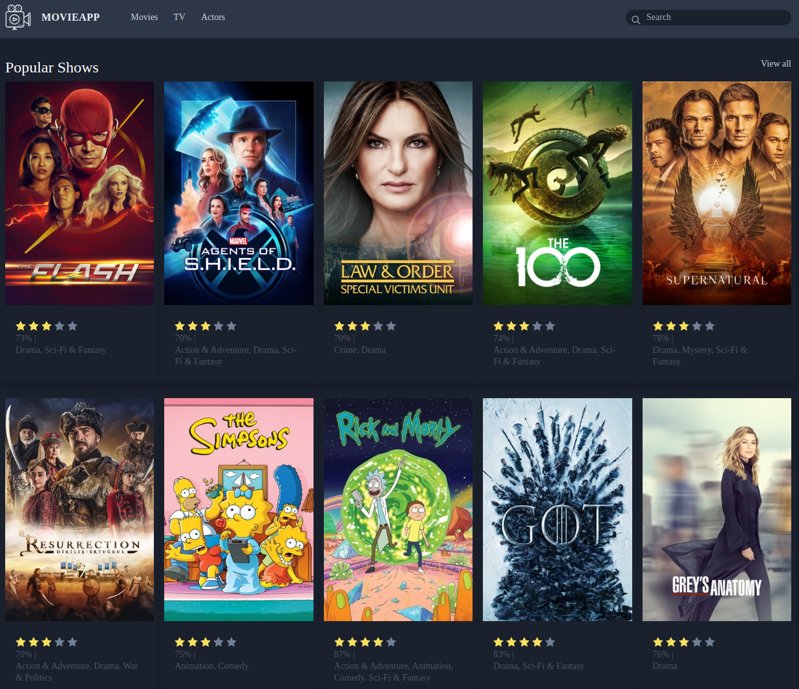
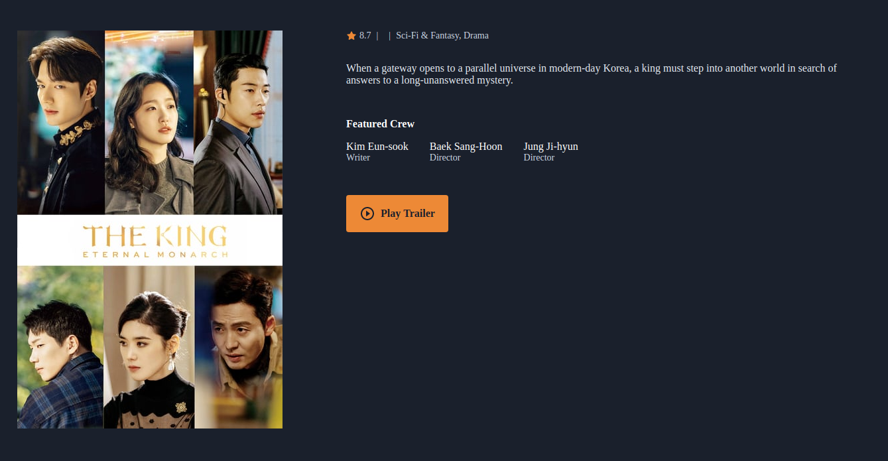

# Vue Movie app
A Simple vue application to display Movies, TV Shows and Actors Information.

# Features

- List 20 Popular and Now Playing Movies
- View Movie Details
- List 20 Popular and Top Rated Tv Shows
- View Tv Show Details
- Shows 20 popular Actors with Infinite Scroll
- Search Everything

## Installation

- Clone the repo
- cd movieapp
- cp env.example .env
- Register and get you auth key from [TMDb](https://www.themoviedb.org/documentation/api)
- Set up auth key in .env file
- npm install
- npm run serve
- visit localhost:8080 in browser

### Project Idea and UI Credits
See [drehimself/laravel-movies-example](https://github.com/drehimself/laravel-movies-example).

### API and Data source
[TMDb](https://www.themoviedb.org/documentation/api)

# Screenshots
Tv Shows Page

Show Detail

Actors Page

Actor Detail

